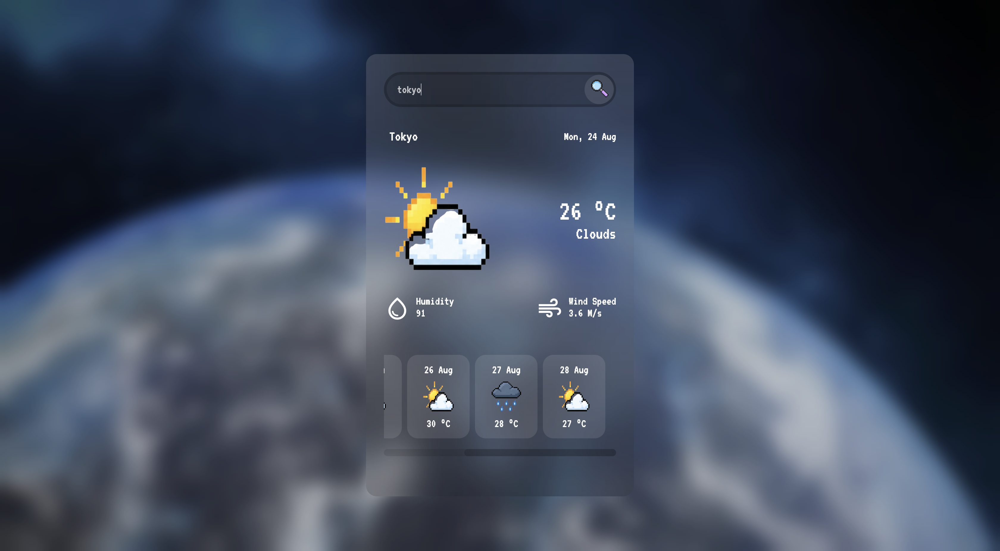
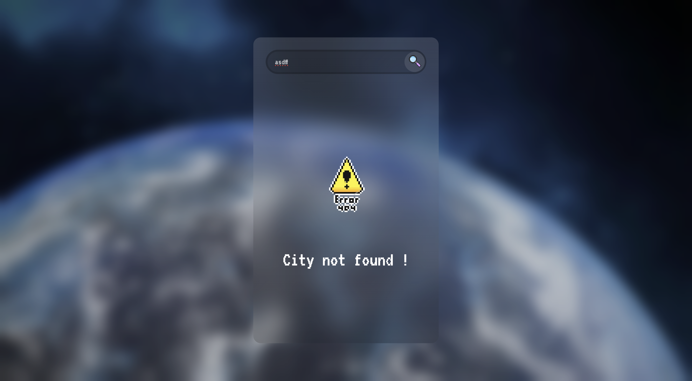

# 🌦️ Weather App

A simple and responsive Weather App built using **HTML, CSS, and JavaScript** that fetches real-time weather data using the **OpenWeather API**.

## ✨ Features

- 🔍 Search weather by city
- 🌡️ Current temperature & weather condition
- 💧 Humidity & wind speed
- 📅 5-day weather forecast
- 🖼️ Custom weather icons
- ⏳ Loading states
- ❌ City not found & network error handling
- 📱 Responsive UI

## 🛠️ Tech Stack

- HTML5
- CSS3
- JavaScript
- OpenWeather API

## 📸 Screenshots

### Weather Dashboard

### City Not Found

## 🧠 What I Practiced

- Working with REST APIs
- `fetch()` & `async/await`
- DOM manipulation
- Dynamic UI rendering
- JSON data processing
- Error handling
- Loading states

## 🚀 Live Demo

[View Live Demo](https://mohitchauhan-stack.github.io/Weather_App/)

## 👨‍💻 Author

**Mohit Chauhan**

Built as a JavaScript practice project.
